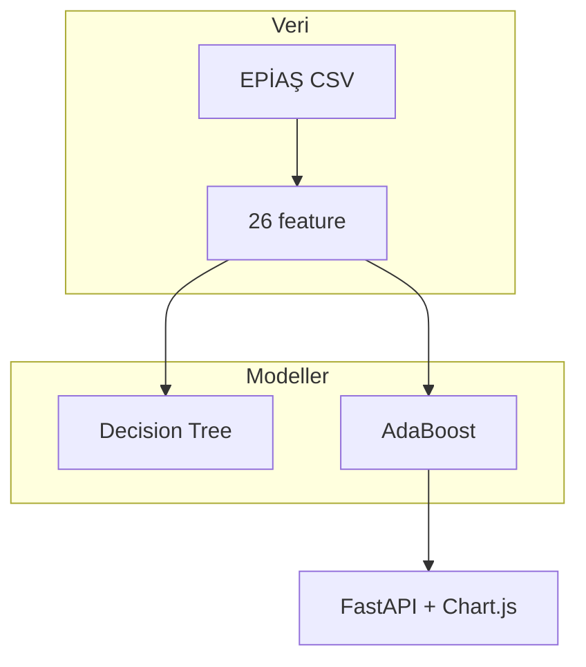
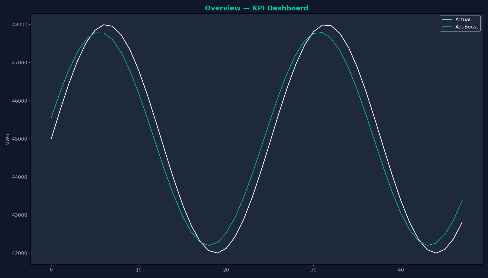
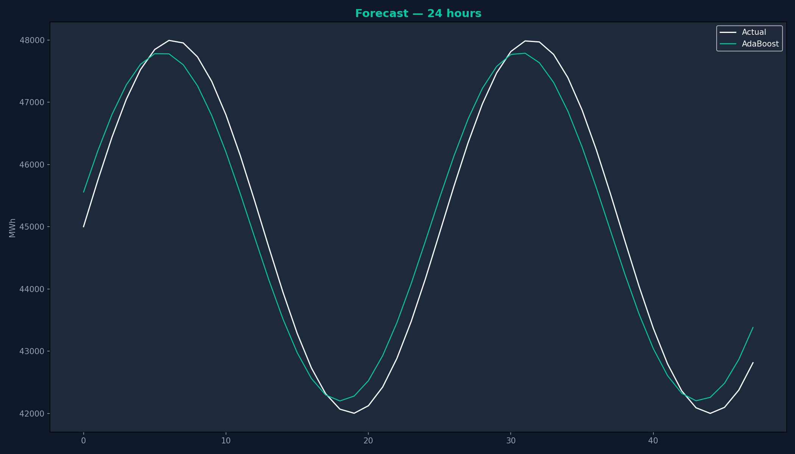

<h1 align="center">Türkiye Saatlik Elektrik Tüketim Tahmini</h1>

<p align="center">
  
  <br><br>
  <strong>Decision Tree + AdaBoost · Test R² ≈ 0.95 · RMSE ≈ 1040 MWh · MAPE ≈ 1.67%</strong>
</p>

<p align="center">
  <a href="https://mee344-g05-stlf.vercel.app"></a>
  <a href="https://github.com/XGami/mee344-g05-stlf"></a>
  
  
  
</p>

**MEE344 Makine Öğrenmesi — Grup G05** · EPİAŞ gerçek zamanlı üretim + tüketim (31.07.2025 – 29.10.2025)

## 30 saniyede demo

```bash
# Windows
run.bat

# veya manuel
py -3 -m pip install -r requirements.txt
py -3 scripts/run_server.py
```

→ **http://127.0.0.1:8000** — backtest grafiği + 24 saat ileri tahmin

## Ne yapıyor?

Saatlik **elektrik tüketimini (MWh)** tahmin eder. Geçmiş tüketim lag’leri, döngüsel zaman özellikleri, tatil bayrakları ve üretim kaynakları (rüzgar, güneş, termik vb.) kullanılır.



## Ekran görüntüleri

| Ana sayfa | Backtest | İleri tahmin |
|-----------|----------|--------------|
|  |  |  |

## Sonuçlar (hold-out test)

| Model | RMSE (MWh) | R² | MAPE |
|-------|------------|-----|------|
| **AdaBoost** | **1040** | **0.951** | **1.67%** |
| Decision Tree | 1311 | 0.923 | 2.38% |
| Baseline (168h) | 1489 | 0.900 | 2.49% |

Detay: [`reports/metrics.json`](reports/metrics.json) · Rapor: [`reports/final_report.md`](reports/final_report.md)

## Hızlı başlangıç

```bash
git clone https://github.com/XGami/mee344-g05-stlf.git
cd mee344-g05-stlf
py -3 -m pip install -r requirements.txt
py -3 scripts/run_all.py          # veri + eğitim + figürler + pptx
py -3 scripts/run_server.py       # web
```

Ham CSV’ler `data/raw/` içinde olmalı (repo ile birlikte veya EPİAŞ export).

## Proje yapısı

```
mee344-g05-stlf/
├── api/              # Vercel serverless
├── web/              # FastAPI + static UI
├── public/           # Vercel static frontend
├── src/mee344_g05/   # Python paketi
├── scripts/          # Pipeline + sunum + sunucu
├── models/           # Eğitilmiş joblib
├── reports/          # Metrikler + figürler
├── slides/           # G05_STLF_DT_AdaBoost.pptx
├── assets/           # Arka planlar + ekran görüntüleri
└── docs/             # DEMO, DEPLOY, HOW_IT_WORKS, QA
```

## Grup

Berhan Kaya · Ahmet Bayram Topçu · Yusuf Duman · Furkan Efe Demirbel · Tekgül Eroğlu

## Lisans

[MIT](LICENSE)

## Dokümantasyon

- [Web demo](docs/DEMO.md)
- [Model açıklaması](docs/HOW_IT_WORKS.md)
- [Vercel deploy](docs/DEPLOY_VERCEL.md)
- [Sunum Q&A](docs/QA_PREP.md)
