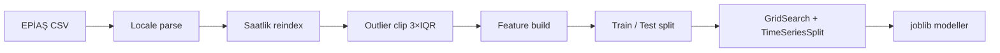

# Model nasıl çalışıyor?

## Problem

**Saatlik elektrik tüketimi (MWh)** regresyonu — kısa vadeli yük tahmini (STLF).

## Veri akışı

- **Train:** ilk ~1665 saat  
- **Test:** son ~336 saat (~14 gün)  
- **CV:** `TimeSeriesSplit(5)`, `random_state=42`

## Özellikler (26 adet, leakage-safe)

| Grup | Örnek |
|------|--------|
| Cyclic time | `hour_sin/cos`, `dow_sin/cos`, `month_sin/cos` |
| Lag & rolling | tüketim `shift(1)`, 24h, 168h; rolling mean/std |
| Takvim | hafta sonu, resmi tatil bayrakları |
| Exogenous | rüzgar, güneş, hidro, termik, ithal, toplam üretim kaynakları |

Lag’ler **yalnızca geçmiş** saatlere bakar (`shift(1)`); gelecek tüketim kullanılmaz.

## Modeller

1. **Decision Tree Regressor** — yorumlanabilir baseline, feature importance.  
2. **AdaBoost Regressor** — zayıf öğreniciler (stump) → güçlü ensemble; G05 allocation.

**Baseline:** mevsimsel naive (168h lag).

## Değerlendirme (test seti)

| Model | RMSE (MWh) | R² | MAPE |
|-------|------------|-----|------|
| AdaBoost | **~1040** | **~0.95** | **~1.67%** |
| Decision Tree | ~1311 | ~0.92 | ~2.4% |

Güncel sayılar: `reports/metrics.json`

## Web tahmin

`web/app_core.py`:

1. Son bilinen saatlerden feature vektörü üretir.  
2. Kayıtlı `decision_tree.joblib` ve `adaboost.joblib` ile tahmin.  
3. İleri saatlerde üretim için son bilinen / forward-fill exogenous varsayımı.

API: `/api/backtest`, `/api/forecast`, `/api/metrics`

## Dosya haritası

| Dosya | Rol |
|-------|-----|
| `src/mee344_g05/features.py` | Feature engineering |
| `src/mee344_g05/models.py` | Model tanımları |
| `scripts/01_build_dataset.py` | Ham → işlenmiş veri |
| `scripts/02_train_decision_tree.py` | DT eğitimi |
| `scripts/03_train_adaboost.py` | AdaBoost eğitimi |
| `scripts/04_evaluate_all.py` | Metrikler + grafikler |
